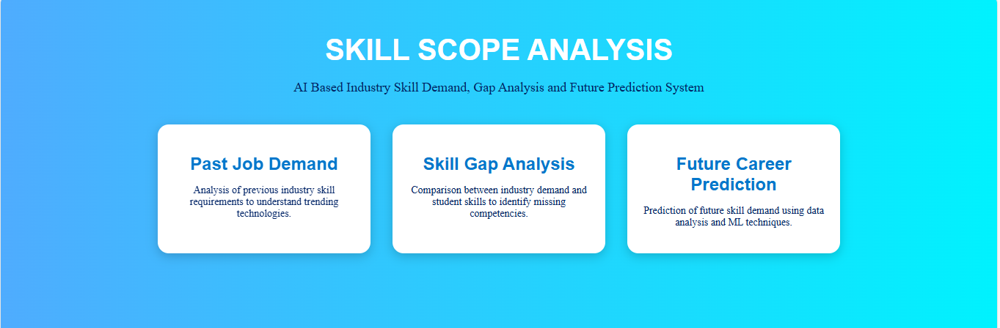
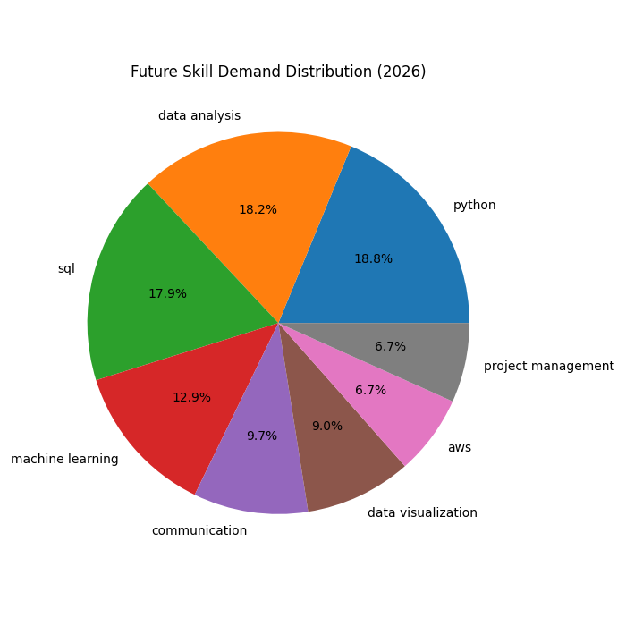
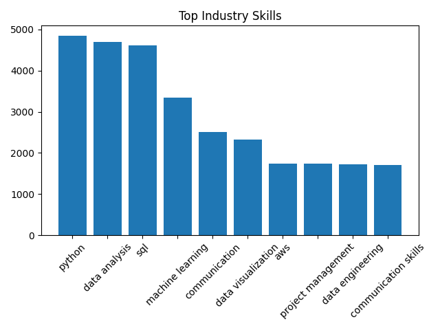
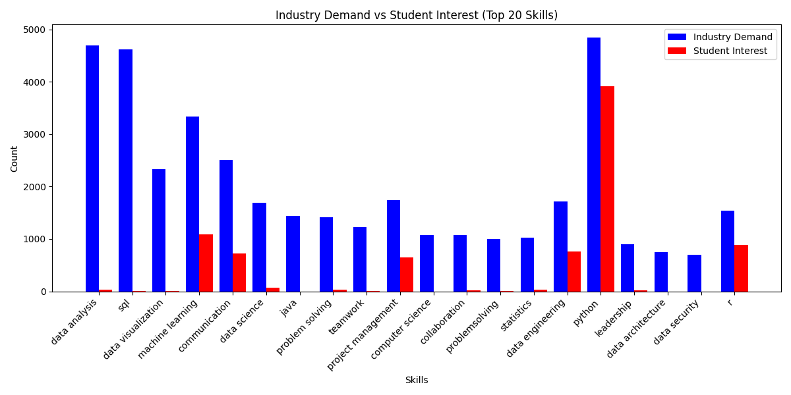

# Skill Scope Analysis System

## 📌 Overview

**Skill Scope Analysis System** is a Flask-based web application that analyzes the gap between **students' skill interests and industry skill demand**.

The system uses student skill-interest data and job posting data to identify:

* Skills currently demanded by the industry
* Skills students are interested in
* The gap between student interest and industry demand
* Future skill demand predictions for 2026

The project combines **data cleaning, data analysis, visualization, and machine learning** to help students understand which technical skills they should focus on for better career opportunities.

---

## 🎯 Objectives

* Analyze historical industry skill demand.
* Understand the skills students are interested in learning.
* Compare student interests with industry requirements.
* Identify skill gaps between students and industry.
* Predict future skill demand for 2026.
* Present the analysis through an easy-to-use web interface.

---

## ✨ Key Features

### 1. Past Job Demand

Visualizes historical industry skill demand using graphs.

This helps identify which technical skills have been frequently required in job postings.

### 2. Skill Gap Analysis

Compares:

**Student Skill Interest vs. Industry Skill Demand**

A grouped bar chart is used to visualize the difference and identify areas where students may need to improve their skills.

### 3. Future Skill Prediction

Predicts the expected demand for different skills in **2026** using a machine learning model.

The project uses **Linear Regression** to generate future skill-demand predictions.

### 4. Interactive Web Application

The analysis is presented through a Flask web application with separate sections for:

* Past Data
* Gap Analysis
* Future Prediction

---

## 🔄 Project Workflow

```text
Student Skill Interest Data
          +
Industry / Job Posting Data
          ↓
     Data Cleaning
          ↓
     Data Analysis
          ↓
   Skill Gap Analysis
          ↓
     Visualization
          ↓
 Future Skill Prediction
          ↓
Skills to Focus On
```

---

## 🤖 Machine Learning

The project uses **Linear Regression** for future skill-demand prediction.

The model analyzes available skill-demand data and generates predicted demand values for **2026**.

Machine learning is mainly used in the **Future Prediction** module.

---

## 🛠️ Technologies Used

* **Python**
* **Pandas** – Data cleaning and analysis
* **NumPy** – Numerical operations
* **Matplotlib** – Data visualization
* **Scikit-learn** – Machine learning
* **Linear Regression** – Future prediction
* **Jupyter Notebook** – Data analysis and model development
* **Flask** – Web application backend
* **HTML**
* **CSS**
* **Git & GitHub**

---

## 📂 Project Structure

```text
Skill Scope Analysis System/
│
├── data/
│   ├── raw/
│   └── processed/
│       ├── student_cleaned.csv
│       ├── industry_cleaned.csv
│       └── gap_analysis.csv
│
├── static/
│   ├── charts/
│   │   ├── past.png
│   │   ├── gap.png
│   │   ├── gap_grouped1.png
│   │   └── future.png
│   │
│   └── style.css
│
├── templates/
│   ├── base.html
│   ├── past.html
│   ├── gap.html
│   └── future.html
│
├── 01_data_cleaning.ipynb
├── 02_gap_analysis.ipynb
├── 03_future_prediction.ipynb
│
├── app.py
├── requirements.txt
├── .gitignore
└── README.md
```

---

## 📊 Application Screenshots

### Home Page

The home page provides an overview of the Skill Scope Analysis System and provides navigation to the different analysis modules.



### Future Skill Prediction

The Future Prediction section displays the predicted skill demand for 2026.



### Past Job Demand

The Past Data section visualizes historical industry skill demand.



### Skill Gap Analysis

The Gap Analysis section uses a grouped bar chart to compare student skill interest with industry skill demand.



---

## 🚀 How to Run the Project

### 1. Clone the repository

```bash
git clone <your-github-repository-url>
```

### 2. Open the project folder

```bash
cd skill-scope-analysis-system
```

### 3. Create a virtual environment

```bash
python -m venv venv
```

### 4. Activate the virtual environment

**Windows:**

```bash
venv\Scripts\activate
```

### 5. Install dependencies

```bash
pip install -r requirements.txt
```

### 6. Run the Flask application

```bash
python app.py
```

### 7. Open the application

Open the local Flask URL shown in the terminal, usually:

```text
http://127.0.0.1:5000/
```

---

## 📈 Results

The system provides a visual comparison between student interests and industry requirements.

It helps identify:

* High-demand industry skills
* Skills with a significant student-industry gap
* Skills expected to have future demand
* Technical areas students can focus on for career development

---

## 🔮 Future Scope

The project can be further enhanced by:

* Integrating real-time job posting data.
* Adding personalized skill recommendations for individual students.
* Using advanced machine learning models for prediction.
* Adding an interactive dashboard.
* Expanding analysis to different industries and job roles.
* Providing career-path recommendations based on individual skills.
* Continuously updating predictions using new job market data.

---

## 👩‍💻 Project

**Skill Scope Analysis System**

Developed as a data analysis, machine learning, and Flask web application project.
